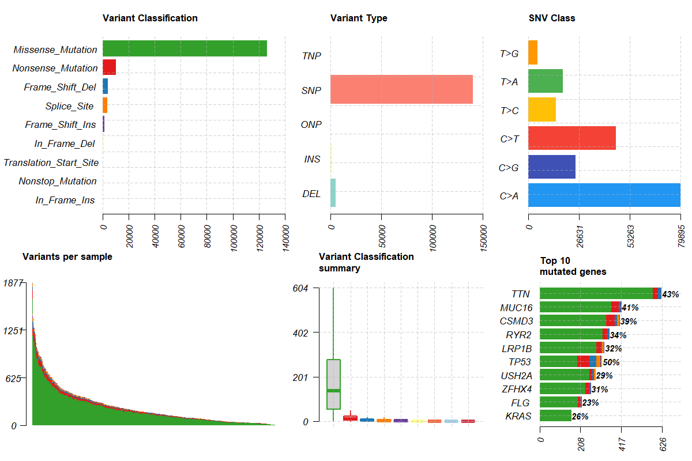
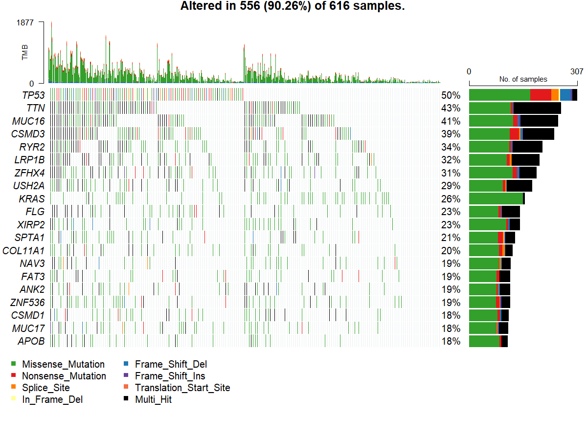
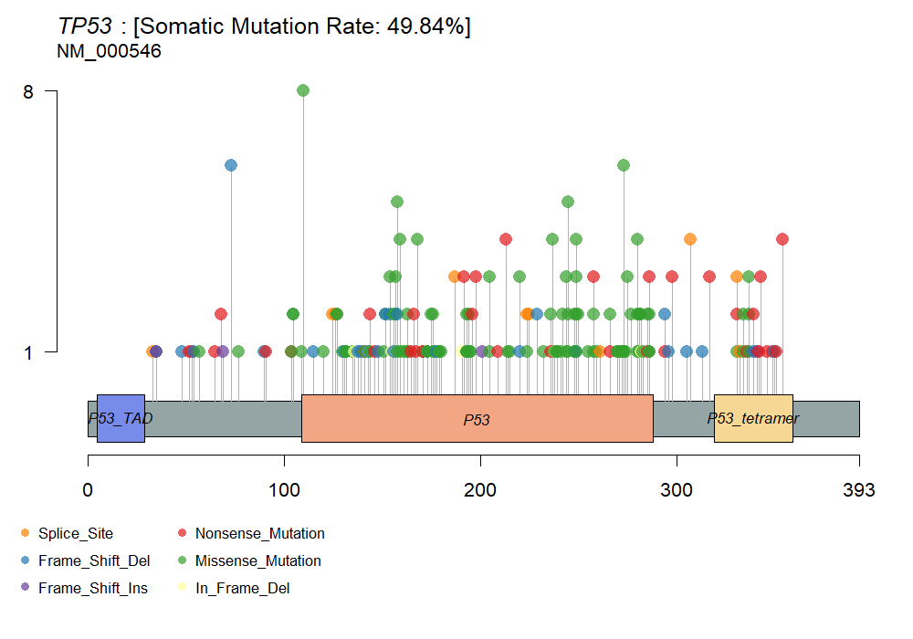

# Genomics Analysis Pipeline

> Cancer genomics workflow for analyzing TCGA somatic mutation data using maftools and Bioconductor in R.

## Overview

This project explores the somatic mutational landscape of lung adenocarcinoma (LUAD) using TCGA mutation data and the `maftools` package in R.

The main goal of this analysis was to investigate:

- frequently mutated genes in LUAD,
- mutation burden across tumor samples,
- dominant mutation classes and variant types,
- and mutation patterns in important driver genes such as TP53.

Using TCGA-LUAD mutation data, I performed mutation profiling, generated mutation summary plots and oncoplots, and analyzed TP53 mutation distributions across tumor samples.

This project was built as part of my exploration into computational cancer genomics and genomic data analysis workflows.

---

# Dataset

- Project: TCGA-LUAD
- Cancer Type: Lung Adenocarcinoma
- Source: Genomic Data Commons (GDC)
- Data Type: Masked Somatic Mutation
- Workflow: Aliquot Ensemble Somatic Variant Merging and Masking

### Associated Publication

The Cancer Genome Atlas Research Network.  
**Comprehensive molecular profiling of lung adenocarcinoma.**  
*Nature*. 2014;511(7511):543–550.

---

# Key Findings

- Analyzed somatic mutation profiles across **616 LUAD samples**
- Detected genomic alterations in **90.26% of samples**
- Missense mutations were the dominant mutation class
- SNPs represented the major variant type
- TP53 and KRAS appeared among the most frequently mutated genes
- Mutation burden varied substantially across samples, indicating strong tumor heterogeneity

---

# Biological Interpretation

## Mutation Landscape

The mutation summary revealed substantial genomic heterogeneity across LUAD tumors. Several samples showed high mutation burdens, suggesting extensive genomic instability.

Missense mutations dominated the mutational spectrum, indicating widespread protein-altering genomic events associated with tumor progression.

---

## Frequently Mutated Genes

The oncoplot identified recurrent mutations in several well-known cancer-associated genes, including:

- TP53
- TTN
- MUC16
- CSMD3
- KRAS
- LRP1B
- USH2A

Many of these genes are commonly reported in LUAD and are associated with disrupted tumor suppressor activity, altered signaling pathways, and genomic instability.

---

## TP53 Mutation Analysis

TP53 showed one of the highest mutation frequencies across samples.

The lollipop plot demonstrated that mutations are distributed across important functional regions of the TP53 protein, particularly within the DNA-binding domain.

These alterations may impair:

- DNA damage response
- apoptosis regulation
- cell-cycle control

which are hallmark mechanisms involved in tumorigenesis.

---

## Mutational Signatures

The SNV class distribution showed strong enrichment of:

- C>A substitutions
- C>T substitutions

These mutation patterns are commonly associated with smoking-related mutational processes observed in lung adenocarcinoma.

---

# Key Visualizations

## Mutation Summary



---

## Oncoplot



---

## TP53 Lollipop Plot



---

# Pipeline

## Genomic Analysis Workflow

- Retrieve mutation data from TCGA
- Prepare MAF object
- Generate mutation summary statistics
- Visualize recurrently mutated genes
- Analyze TP53 mutation distribution
- Export gene mutation summaries

---

# Project Structure

```text
scripts/
└── tcga_luad_maf_analysis.R

results/
├── figures/
│   ├── TCGA_LUAD_maf_summary.png
│   ├── TCGA_LUAD_oncoplot.png
│   └── TCGA_LUAD_TP53_lollipop.png
│
└── tables/
    └── TCGA_LUAD_gene_summary.csv
```

---

# How to Run

## Install Required Packages

```r
if (!requireNamespace("BiocManager", quietly = TRUE))
  install.packages("BiocManager")

BiocManager::install(c("TCGAbiolinks", "maftools"))
```

## Run Analysis

```r
source("scripts/tcga_luad_maf_analysis.R")
```

---

# Output Files

## Figures

- TCGA_LUAD_maf_summary.png
- TCGA_LUAD_oncoplot.png
- TCGA_LUAD_TP53_lollipop.png

## Tables

- TCGA_LUAD_gene_summary.csv

---

# Tools Used

- R
- TCGAbiolinks
- maftools
- Bioconductor

---

# Reproducibility

Tested on:

- R >= 4.5
- maftools
- TCGAbiolinks

---

# Author

Gideon Samuel
